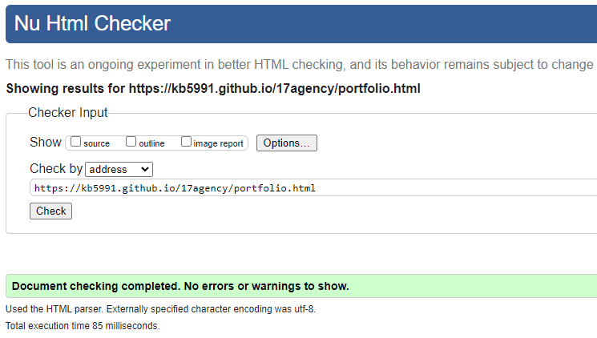
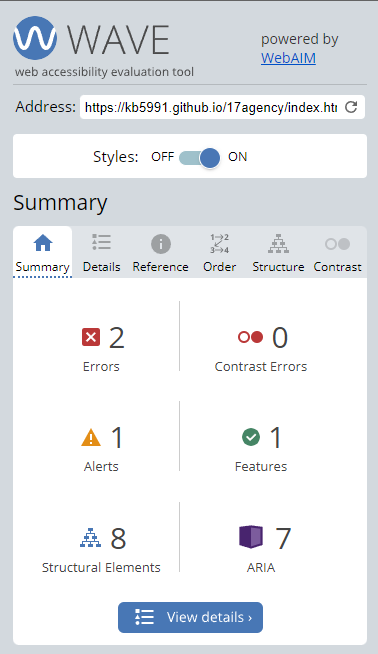

# Seventeen Agency

[View the live website here.](https://kb5991.github.io/17agency/index.html)

## Introduction

This website is created to showcase the business and portfolio works of the creative styling agency; Seventeen Agency. The purpose of this website is to target industry professionals looking for an agency to aid them with fashion styling, hair and makeup, photography and creative direction for any projects from editorial to digital. Visitors are met with informative headings at the top of the page, directing them to various pages to learn more about the agency, from an about page to a vibrant portfolio of previous works, to a contact page for any enquiries. Below, the footer links to the agency's external social media pages for further browsing.
The website has been designed responsively, to work effectively on all device sizes and with a minimal design to ensure ease of navigation and to be aesthetically pleasing to the eye.

## User Experience

### Business Goals

1. To convey Seventeen Agency's company directive to visitors and introduce business for potential clients.
2. To showcase the type of work that Seventeen Agency does by updating the portfolio frequently to keep existing and potential clients up to date.
3. To build a rapport with clients with strong communication across all channels - via the website and social media pages.

### User Goals

1. To be able to easily navigate through the website through informative header and footer elements.
2. To be able to easily learn about Seventeen Agency, what it does and how can it help improve your own or business needs.
3. To be able to see existing work from the portolio page to know what to expect from the agency.
4. To be able to communicate with the agency for any enquiries or bookings.
5. As a returning visitor, the expectancy to see up-to-date information on any new portfolio work done by the agency.

## Design

### Colour Scheme

The colour scheme for this website was chosen mainly for accessibility purposes and is kept to a simple black and white theme to ensure that there is sufficient contrast between the background and any text used on the website - as can be seen below via Adobe Color. The only other colour on the website comes from the images.

### Typography

The fonts used for this website are 'DM Serif Display' for the headings and 'DM Sans' for all other text - as paired by fontpair.co and imported via Google Fonts, with 'serif' and 'sans-serif' set as fallback fonts respectively.

### Imagery

The imagery for this website was sourced mainly from pexels.com (with exception of the homepage hero image sourced from unsplash.com). The images were chosen specifically to have an editorial aesthetic - meaning that the images were to look as though they had jumped from the pages of a magazine or a campaign photoshoot to give the look and feel of high quality production by Seventeen Agency. The images were all compressed using tinypng.com and then converted to webp format using pixelied.com.

### Wireframes

The wireframes for this website were created using Balsamiq.com. Originally, as seen in the wireframes below, the design was set to include a logo consisting of a black circle enclosing the number '17' in place of the heading 'Seventeen Agency'. This logo was scrapped for the final version of the website and was kept only as the favicon. This change was made partly due to aesthetic purposes and because the heading of 'Seventeen Agency' conveyed more clearly the purpose of the website as opposed to a circular logo with just a number inside of it.

The website consists of five pages in total, the Home page, the About page, the Portfolio page, the Contact page and finally, the Thank You page which users are redirected to upon completion of the contact form. In the original designs for the website, this was set to include three pages only, with the homepage acting as the portfolio page also so that visitors could see immediately the type of work that the agency produced. However, this was changed to include a landing page with a singular hero image and informative heading which, when clicked, takes the user to the 'About' page. This design decision was made to make the website easier to navigate and made more sense for the user to visit the 'About' page first to learn more about Seventeen Agency and then move onto the 'Portfolio' page to see previous works.

1. Original Home page Design on Web and iPhones:

2. Contact page on Web and iPhone:

3. About page on Web and iPhone:

4. All pages on iPad:

## Features

### Header and navbar

The navbar for this website is situated at the top of each page, with the name of the business positioned to the left and all navigational elements set to the right. This is set to be the same on all size devices with the navigational elements collapsing into a hamburger menu on smaller screens. The page being viewed is underlined with the other page titles showing as underlined upon mouse hover. The business logo when tapped/clicked takes the user back to the homepage.

1, Navbar as seen on laptops and desktop viewers:

2, Navbar as seen on small phone screens (on larger phone screens the logo remains on one line) with collapsible hamburger menu:

### Footer and social media icons

The footer is situated at the bottom of each page, with clickable links to the Instagram, Tiktok and YouTube social media pages of the business.

### Landing/Homepage

The landing page boasts an aesthetic, high quality, fashion photograph - showcasing the agency's work upon the first visit to the the website. This image, along with the single across the image helps the user to understand the type of quality and services on offer by Seventeen Agency. The landing image and text when clicked/tapped will take the user to the website's 'About' page.

### About page

The about page features the agency's main goals and initiatives, the services and talent they provide and inviting potential clients to collaborate with them. Complementary images are used to break up the text and bring colour to the page.

### Portfolio page

The portfolio page features the high quality work produced by the agency, to show current and potential clients what they can expect from Seventeen Agency upon working with the business. The page has been designed to work responsively, with 5 columns of imagery on laptops and desktops, down to 3 columns on tablets, and a singular column on phones.

### Contact page

The contact page features a striking background image with an overlayed form allowing the user to contact the agency with any enquiries. All fields in the form are required and will flag a warning if any are missed or if the email address is entered incorrectly. Upon completion, the form will take the user to the 'Thank You' page.

### Thank You page

Upon clicking the submit form on the contact page, the user is redirected to the 'Thank You' page with further information on when they can expect a response to their enquiry or, alternative means of communication via the agency's social media pages.

### Future Implemenations

In the future I would like to implement a feature where the images in the portfolio can have captions with names of the particular talent - whether they were a fashion stylist or a hair and makeup artist for example, who contributed to that particular campaign/shoot and links to their own portfolio pages for clients to see and choose who they wish to work with.

### Accessibility

Aria labels have been used consistently on all pages as well as alt text on images for ease of use for screen readers and for any broken image links. I have also included fallback fonts should the specified fonts fail to load as well as semantic elements for easy navigation.

## Technologies Used

**Github** - used for version control, site storage and for deploying my project.\
**Codeanywhere** - this is the IDE that I used to write, edit, commit and push my code to Github.\
**Python** - used to open a local http server when coding in Codeanywhere to preview my site.\
**HTML 5** - used to build the core of my website.\
**CSS** - used to style all elements of my website.\
**DevTools** - used to test the responsiveness of my website and check for bugs.\
**Fontpair.co** - used to find complementary font pairings.\
**Google Fonts** - used to import the fonts used.\
**Font Awesome** - used to import social media icons for the footer.\
**Pexels** - used to source website imagery.\
**Unsplash** - used to source website imagery.\
**TinyPNG** - used to compress all website imagery.\
**Pixelied.com** - used to convert all imagery into wepb format.\
**Favicon.io** - used to create favicon for my website.\
**Beautify extension on Codeanywhere** - used to format code correctly.\
**Balsamiq** - used to create the wireframes for the initial design process of my website.\
**Am I Responsive?** - used to test the responsiveness of the website.

## Languages Used

HTML 5, CSS

## Libraries and programmes used

Github was used for version control, site storage and for deploying my project to Github pages. Codeanywhere is the IDE I used to write, edit, commit and push my code to Github.

## Deployment

I deployed my website early on Github pages.

## Local Deployment

#### How to Clone

1. Log into your account on GitHub
2. Go to the repository of this project <https://github.com/kb5991/17agency>
3. Click on the code button, and copy your preferred clone link.
4. Open the terminal in your code editor and change the current working directory to the location you want to use for the cloned directory.
5. Type 'git clone' into the terminal, paste the link you copied in step 3 and press enter.

#### How to Fork

To fork the repository:

1. Log in (or sign up) to Github.
2. Go to the repository for this project, <https://github.com/kb5991/17agency>
3. Click the Fork button in the top right corner.

## Testing

### Manual Testing

#### Jigsaw CSS Validator used to validate the CSS code written for my website

#### W3C Validator used to validate the HTML 5 code written on all pages for my website

#### Lighthouse Testing

I used Google Chrome's Lighthouse Developer Tool for insight on the performance and accessibility measures of my website. Initially, the performance and speed was slowed down greatly by large images even though they had been compressed, sometimes twice, using TinyPNG.com. I had then converted these images from jpeg format to webp, which significantly improved the performance of my website. Below are the final Lighthouse results.

**Index Page:**

**About Page:**

**Portfolio Page:**

**Contact Page:**

**Thank You Page:**

#### Wave Testing

I used the Wave Web Accessibility Evaluation tool to check the accessibility of my website. The errors detected are due to the hamburger icon used for the collapsible menu on smaller screens - as this function was created with help from the Love Running project, which also flags the same errors via Wave, I have not yet come up with a solution for this.

#### Device Testing

The website was tested on the following devices:

- iPhone 13 Pro

- iPhone 13 Pro Max

- iPhone 15 Pro

- iPad Air 11"

- Macbook Pro 13" 2020

- ASUS Rog Strix Gaming Laptop 15.6"

- 24" widescreen monitor

The website was tested on the following browsers:

- Google Chrome

- Safari

- Microsoft Edge

Additional testing was done on a variety of devices and screen sizes.

| Feature | Expected Outcome | Testing Performed | Result | Pass/Fail |
| --- | --- | --- | --- | --- |
| `Navbar` |
|  |  |  |  |  |
| Seventeen Agency Logo | When clicked the user will be redirected to the Home page. | Clicked logo | Redirected to the Home page. | Pass |
| Home Link | When clicked the user will be redirected to the Home page.| Clicked link | Redirected to the Home page. | Pass |
| About Link | When clicked the user will be redirected to the About page. | Clicked link | Redirected to the About page. | Pass |
| Portfolio Link | When clicked the user will be redirected to the Portfolio page. | Clicked link | Redirected to the Portfolio page. | Pass |
| Contact Link | When clicked the user will be redirected to the Contact page. | Clicked link | Redirected to the Contact page. | Pass |
| --- | --- | --- | --- | --- |
| `Footer` |
|  |  |  |  |  |
| Social Media Icons | When clicked the user will be redirected to the appropriate social media pages in a new window. | Clicked icon | Redirected to the social media page in a new window. | Pass |
| --- | --- | --- | --- | --- |
| `Home Page` |
|   |   |   |   |
| Landing Image and Text | When clicked the user will be redirected to the About page. | Clicked landing image and text | Redirected to the About page. | Pass |
| --- | --- | --- | --- | --- |
| `Portfolio Page` |
|   |   |   |   |
| Portfolio responsiveness | When window is resized the portfolio is responsive and site layout looks as expected. | Resized window | Portfolio is responsive and site layout looks as expected.| Pass |
| --- | --- | --- | --- | --- |
| `Contact Page` |
|   |   |   |   |
| Contact form | Required fields and correct email address format needed in order to submit.| Clicked submit while leaving form unfillled | Form will not submit without a name, a correctly formatted email address and a message. | Pass |
| Submit button | Upon correct completion and submission of form, user is redirected to the Thank You page. | Form completed, submit button clicked | User redirected to Thank You page. | Pass |

## Bugs

Upon conducting my initial Lighthouse tests, I came across a semantic error on the index and thank you pages of my website. Both pages use the same format, a background image with overlaying text. I had initially used h3 headings for this text however, this was flagged by the Lighthouse tests as a semantic error, bringing down the accessibility scores of these pages. After encountering this error, I amended it by changing the h3 headings to h2 headings which brought the accessibility scores up to 100 as can be seen above.

Index page accessibility score prior to heading fix:

Thank you page accessibility score prior to heading fix:

Heading semantic error:

As a result of using compressed jpeg images across my website, the performance and loading speeds were impacted as can be seen the strongest in the initial Lighthouse testing scores of my portfolio page below:

Upon converting the imagery to webp format, the perfomance of my website scored much higher across all pages, bringing up the initial score of 51 to 72 on my portfolio page as can be seen in the final testing in the section above.

## Credits

**Code Assistance:**

The asterisk wildcard selector styles and navbar styles for the collapsible hamburger menu were written with assistance from the Love Running Project.

I used YouTube for tutorials regarding media queries and Flexbox.

Media Queries: https://www.youtube.com/watch?v=yU7jJ3NbPdA&t=175s

Flexbox: https://www.youtube.com/watch?v=fYq5PXgSsbE

**Copy:**

All copy on the about page was written by Chat GPT. <https://chat.openai.com/>

**Images:**

All images were sourced from Pexels.com and Unsplash.com.

**Acknowledgements:**

I would like to acknowledge and thank mentors Luke Buchanan and Chris Quinn for their incredible insight, clear and constructive feedback on this project, and for always giving me reassurance that I was heading in the right direction.